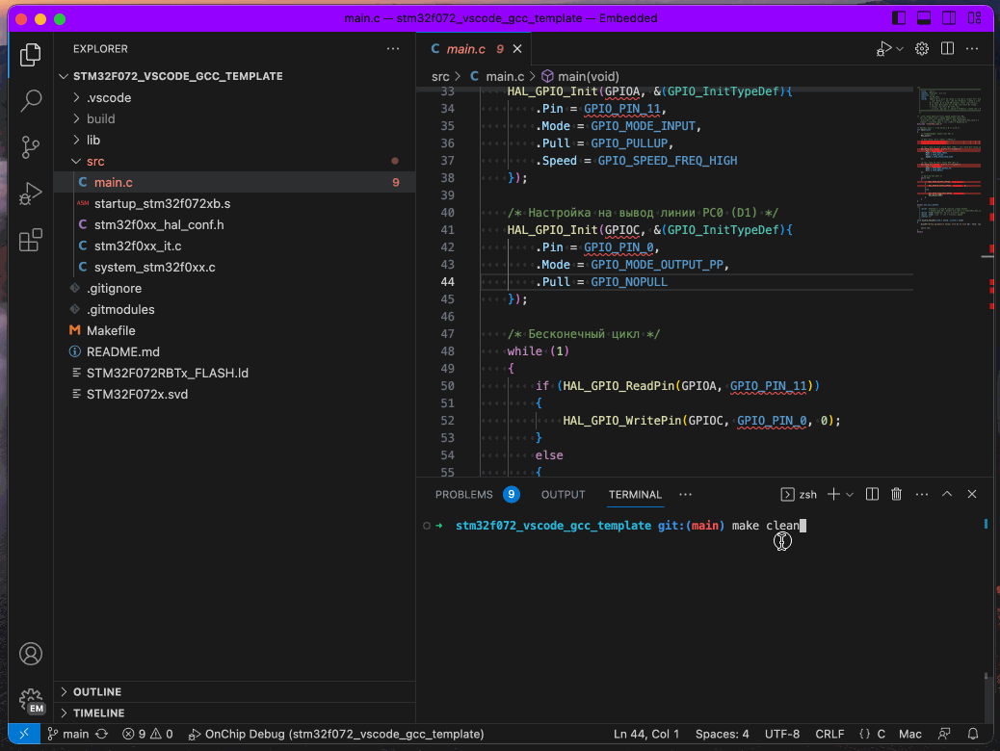
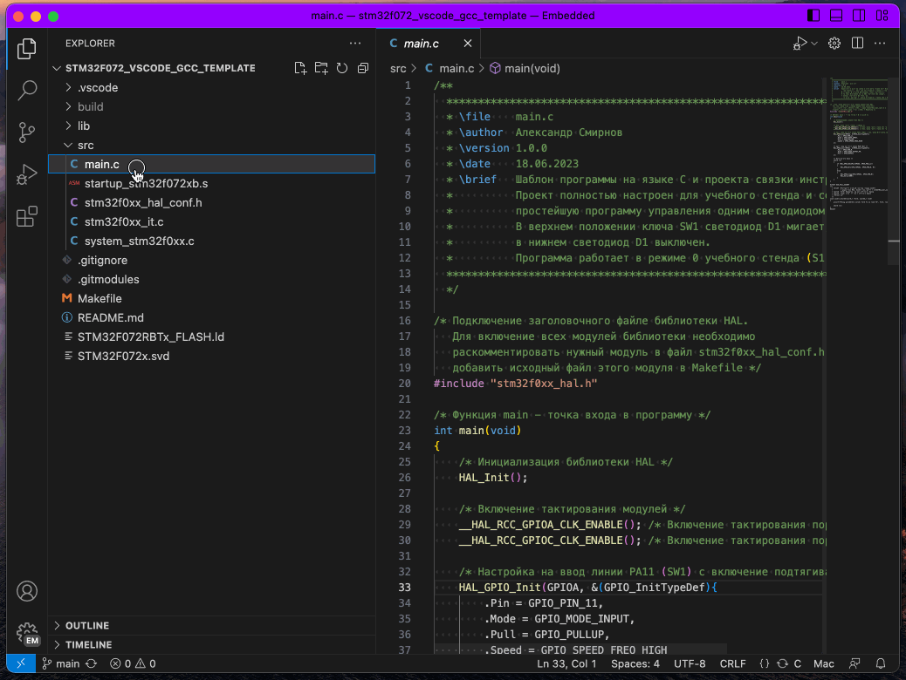

# Шаблон проекта для МК stm32f072 в редакторе `Visual Studio Code` и набором инструментов gcc

Установка всех компонентов происходит в командной строке.
Последовательность действий зависит от операционной системы.

Для работы потребуется кросс-компилятор `arm-none-eabi-gcc`, утилита сборки `make`, отладчик `openocd`,
система контроля версия `git` и текстовый редактор `Visual Studio Code` с расширениями.

Пример использует библиотеки [CMSIS](https://github.com/STMicroelectronics/cmsis_core),
[CMSIS Device F0](https://github.com/STMicroelectronics/cmsis_device_f0) и
[HAL F0](https://github.com/STMicroelectronics/stm32f0xx_hal_driver).

## Назначение директорий и файлов

- `.vscode/` - директория с настройка редактора `Visual Studio Code`
  - `c_cpp_properties.json` - настройки плагина `C/C++ for Visual Studio Code`
  - `launch.json` - настройки конфигураций отладки
  - `tasks.json` - настройки конфигураций сборки и загрузки
  - `settings.json` - локальные настройки `Visual Studio Code`
- `.git/` - директория системы контроля версия `git`
- `lib/` - директория с внешними библиотеками
  - `cmsis_core/` - директория с библиотекой поддержки ядер `Cortex-M`
  - `cmsis_device_f0/` - директория с библиотекой описания регистров микроконтроллеров `STM32F0xx`
  - `stm32f0xx_hal_driver/` - директория с библиотекой драйверов `HAL` для микроконтроллеров `STM32F0xx`
- `src/` - исходные и заговоловочные файлы проекта
  - `main.c` - исходный файл с функцией `main`
  - `startup_stm32f072xb.s` - файл startup
  - `stm32f0xx_hal_conf.h` - настройки `HAL`
  - `stm32f0xx_it.c` - подпрограммы обработчики прерываний
  - `system_stm32f0xx.c` - шаблон с системными настройками микроконтроллера (тактирование, Flash)
- `build/` - временная директория с результатами сборки (отсутсвует в `git`)
  - `*.elf` - образ (результат сборки) в формате [ELF](https://en.wikipedia.org/wiki/Executable_and_Linkable_Format)
  - `*.bin` - образ (результат сборки) в формате bin
  - `*.hex` - образ (результат сборки) в формате [Intel HEX](https://en.wikipedia.org/wiki/Intel_HEX)
  - `*.map` - карта распределения объектный файлов (`*.o`) по адресному пространству
  - `*.o`   - объектный файл (машинный код в относительных адресах) для каждого исходного файла
  - `*.lst` - листинг для каждого исходного файла
  - `*.d`   - файл зависимостей для каждого исходного файла
- `.gitignore` - файлы и директории, исключенные из системы контроля версий
- `.gitmodules` - подмодули `git`
- `Makefile` - файл сборки
- `README.md` - это описание в формате [Markdown](https://github.com/adam-p/markdown-here/wiki/Markdown-Cheatsheet)
- `STM32F072RBTx_FLASH.ld` - сценарий компоновщика
- `STM32F072x.svd` - описание структуры МК (регистры специальных функций) для отладчика

## Установка компонентов

### Windows

Открыть командную строку `PowerShell` в **режиме администратора**.

- Скачать и установить пакетный менеджер `Chocolatey`

    Пакетный менеджер позволит быстро устанавливать необходимые программы не прибегая к поиску установочных файлов в интернете.

    Установка выполняется командой:

    ```shell
    Set-ExecutionPolicy Bypass -Scope Process -Force; [System.Net.ServicePointManager]::SecurityProtocol = [System.Net.ServicePointManager]::SecurityProtocol -bor 3072; iex ((New-Object System.Net.WebClient).DownloadString('https://community.chocolatey.org/install.ps1'))
    ```

    Проверить установку следует командой:

    ```shell
    choco --version
    ```

    Если установка прошла успешно, то в командной строке напечатается версия программы, например

    ```shell
    2.0.0
    ```

- Установить кросс-компилятор `arm-none-eabi-gcc` и другие инструмент:

    ```shell
    choco install gcc-arm-embedded
    choco install make
    choco install openocd
    choco install git
    ```

  Проверка правильности установки:

  ```shell
  arm-none-eabi-gcc --version
  make --version
  openocd --version
  ```

  Каждая команда должна вернуть свою версию.

- Скачать и установить текстовый редактор `Visual Studio Code`.

### Linux

- Установка в системах с пакетным менеджером `apt`:

  ```shell
  sudo apt install arm-none-eabi-gcc
  sudo apt install make
  sudo apt install openocd
  sudo apt install git
   ```

  Проверка правильности установки:

  ```shell
  arm-none-eabi-gcc --version
  make --version
  openocd --version
  git --version
  ```

  Каждая команда должна вернуть свою версию.

- Скачать и установить текстовый редактор `Visual Studio Code`.

### macOS

- Установка в системах с пакетным менеджером `brew`:

  ```shell
  brew tap ArmMbed/homebrew-formulae
  brew install arm-none-eabi-gcc
  brew install openocd
  ```

  Проверка правильности установки:

  ```shell
  arm-none-eabi-gcc --version
  make --version
  openocd --version
  git --version
  ```

  Каждая команда должна вернуть свою версию.

- Скачать и установить текстовый редактор `Visual Studio Code`.

### Текстовый редактор `Visual Studio Code`

Инструкция применима для всех операционных систем.

- Загрузить и установить с сайта версию [Visual Studio Code](https://code.visualstudio.com/) в соответствие с вашей операционной системой.

- Установить расширения можно экспортировав [профиль](https://vscode.dev/profile/github/d154b188761da254148fd884e56f8c8d) или установить следующие расширения (extensions) вручную:

  - Для работы с кодом на языке C/C++ - [C/C++ for Visual Studio Code](https://marketplace.visualstudio.com/items?itemName=ms-vscode.cpptools)

  - Для визуализации отладки - [Cortex-Debug](https://marketplace.visualstudio.com/items?itemName=marus25.cortex-debug)

  - Для подсветки синтаксиса ассемблера - [Arm Assembly](https://marketplace.visualstudio.com/items?itemName=dan-c-underwood.arm)

  - Для подсветки синтаксиса скрипта компоновщика - [LinkerScript](https://marketplace.visualstudio.com/items?itemName=ZixuanWang.linkerscript)

  - Для подсветки map файлов - [GNU Linker Map files](https://marketplace.visualstudio.com/items?itemName=trond-snekvik.gnu-mapfiles)

  - Для работы с последовательным портом - [Serial Monitor](https://marketplace.visualstudio.com/items?itemName=ms-vscode.vscode-serial-monitor)

## Клониирование репозитория

Проект содержит подмодули с библиотекам от ST.

Для клонирования с подмодулями выполните следующу команду

```bash
git clone --recurse-submodules -j8 https://github.com/smirnovalnik/stm32f072_vscode_gcc_template.git
```

## Работа с проектом в командной строке

Сборка проекта:

```bash
make all
```

Очистка проекта:

```bash
make clean
```

Загрузка образа в МК:

```bash
make download
```



## Отладка в `Visual Studio Code`


